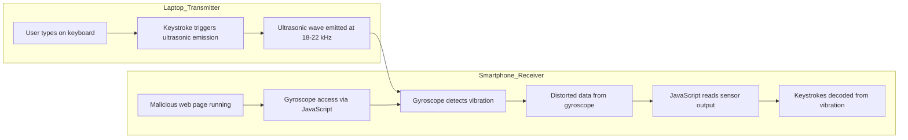

```mermaid
flowchart LR
    %% Laptop (Transmitter)
    subgraph Laptop_Transmitter
        A1[User types on keyboard]
        A2[Keystroke triggers ultrasonic emission]
        A3[Ultrasonic wave emitted at 18-22 kHz]
    end

    %% Smartphone (Receiver)
    subgraph Smartphone_Receiver
        B1[Malicious web page running]
        B2[Gyroscope access via JavaScript]
        B3[Gyroscope detects vibration]
        B4[Distorted data from gyroscope]
        B5[JavaScript reads sensor output]
        B6[Keystrokes decoded from vibration]
    end

    %% Flow connections
    A1 --> A2 --> A3 --> B3
    B1 --> B2 --> B3
    B3 --> B4 --> B5 --> B6
```
