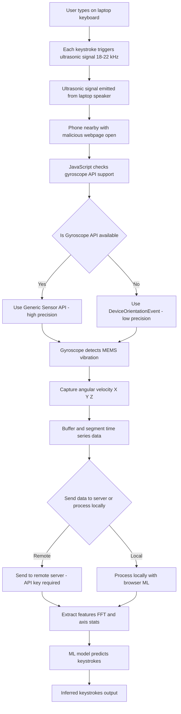

```mermaid
flowchart TD

%% Phase 1: Attack Trigger
    A1[User types on laptop keyboard]
    A2[Each keystroke triggers ultrasonic signal 18-22 kHz]
    A3[Ultrasonic signal emitted from laptop speaker]

%% Phase 2: Signal Reception on Phone
    B1[Phone nearby with malicious webpage open]
    B2[JavaScript checks gyroscope API support]
    B3{Is Gyroscope API available}
    B4[Use Generic Sensor API - high precision]
    B5[Use DeviceOrientationEvent - low precision]

%% Phase 3: Sensor Reading
    C1[Gyroscope detects MEMS vibration]
    C2[Capture angular velocity X Y Z]
    C3[Buffer and segment time series data]

%% Phase 4: Optional Server Use 
    D1{Send data to server or process locally}
    D2[Send to remote server - API key required]
    D3[Process locally with browser ML]

%% Phase 5: ML Inference
    E1[Extract features FFT and axis stats]
    E2[ML model predicts keystrokes]
    E3[Inferred keystrokes output]

%% Flow Connections
    A1 --> A2 --> A3 --> B1
    B1 --> B2 --> B3
    B3 -- Yes --> B4 --> C1
    B3 -- No  --> B5 --> C1
    C1 --> C2 --> C3 --> D1
    D1 -- Remote --> D2 --> E1
    D1 -- Local  --> D3 --> E1
    E1 --> E2 --> E3
```
