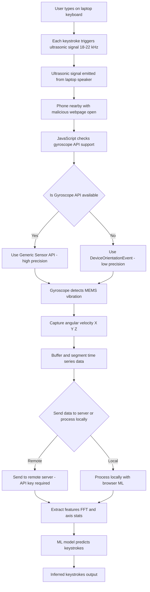

Phase 1: Attack Trigger (Laptop Side)

🔹 A1: User Types on Laptop Keyboard
A normal user is typing on the compromised laptop.

Each keystroke is captured by software or malware already running on the system.

🔹 A2: Each Keystroke Triggers Ultrasonic Signal (18–22 kHz)
For every keypress, the software emits a short ultrasonic tone.

These tones are inaudible to humans, but they are at the resonance frequency of MEMS gyroscope structures.

🔹 A3: Ultrasonic Signal Emitted via Laptop Speaker
The ultrasonic signal is played through the laptop's built-in speakers.

Each tone may represent a binary sequence or just mark the occurrence of a keypress.

🔷 Phase 2: Signal Reception on Smartphone
🔹 B1: Smartphone Nearby with Malicious Web Page Open
A smartphone is placed near the laptop, possibly in the user's pocket or on the desk.

A malicious webpage is open in the browser (e.g., from a phishing link, QR code, or social media bait).

🔹 B2: JavaScript Checks for Gyroscope API Support
The webpage runs JavaScript which checks what gyroscope APIs are available in the current browser.

🔹 B3: Is 'Gyroscope' in window? ✅🔀❌
This decision block checks whether the browser supports the Generic Sensor API, which includes the Gyroscope interface.

Based on this check, it chooses between high-precision or fallback method.

🔹 B4: Use Generic Sensor API (High Precision) ✅
If supported, the JS uses the Gyroscope API to read precise angular velocity (rad/s) at a high sampling rate (e.g., 100 Hz).

This is ideal for your ML-based signal analysis.

🔹 B5: Fallback to DeviceOrientationEvent (Low Precision) ❌
If not supported, the script falls back to deviceorientation events, which give orientation angles (alpha, beta, gamma).

Less accurate, but usable for low-fidelity attacks.

🔷 Phase 3: Sensor Reading
🔹 C1: Gyroscope Reads Internal MEMS Vibrations
The MEMS gyroscope is physically affected by the ultrasonic signal.

The internal vibrating structure resonates, creating false movement data.

🔹 C2: Time-Series X, Y, Z Angular Velocity Captured
The gyroscope logs angular velocity in 3 axes: X, Y, Z.

The data is collected at a defined frequency (e.g., 100 Hz) for processing.

🔹 C3: Buffer & Segment Signal into Windows
The gyroscope signal is segmented into time windows (e.g., 1-second or 200 ms chunks).

This is necessary to analyze discrete keystrokes or ultrasonic bursts.

🔷 Phase 4: Optional Server Use
🔹 D1: Send Data to Server or Process Locally? 🌐💻
A decision is made:

Should the gyroscope data be sent to a remote server?

Or should it be processed in-browser?

🔹 D2: Send Buffered Data to Remote Server (Requires API Key)
If sent to a server, the JS sends it via HTTP/POST or WebSocket.

This may require an API key for authentication (if using services like Firebase, etc.).

🔹 D3: Process Locally using ML In-Browser
If processed locally, the webpage uses TensorFlow.js or another ML library to predict keystrokes on-device, with no network traffic.

🔷 Phase 5: ML Inference
🔹 E1: Feature Extraction (FFT, Axis Stats)
The raw gyroscope data is transformed into features:

FFT (Fast Fourier Transform)

Mean, variance, peaks per window

Axis correlations, etc.

🔹 E2: ML Model (e.g., CNN/SVM) Predicts Keystroke
A trained ML model (e.g., CNN, SVM, or Random Forest) is run on the feature vector.

It classifies the pattern into a specific keystroke or data bit.

🔹 E3: Output Inferred Keystrokes
The system outputs the inferred character or key.

These can be logged, displayed, or sent elsewhere — completing the covert exfiltration of typed data.

It classifies the pattern into a specific keystroke or data bit.

🔹 E3: Output Inferred Keystrokes
The system outputs the inferred character or key.

These can be logged, displayed, or sent elsewhere — completing the covert exfiltration of typed data.
